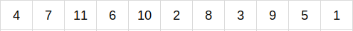
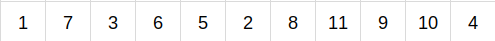
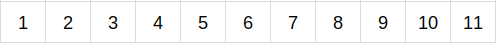
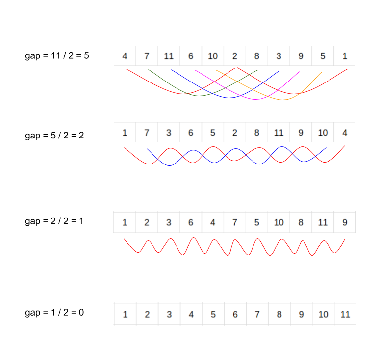

###### Universidade de Brasília - Faculdade Gama

###### Disciplina: Estrutura de Dados e Algoritmos 2

###### Professor: Maurício Serrano

###### Alunos:
  - Victor Matias Navarro - 14/0032932
  - Vítor Barbosa de Araujo - 14/0033149

###### Assunto: Lista de exercícios 2

#### 4. Imagine um vetor onde o menor elemento está na última posição. Explique (use um diagrama de um vetor com 11 posições) como o Shellsort garante que esse elemento conseguirá chegar à sua posição final através de trocas sucessivas baseadas no gap.

Imaginando um vetor de 11 elementos, o *gap* inicial será de 5 (divisão inteira de 11 / 2). Utilizando o vetor da imagem acima, têm-se os seguintes subgrupos (de acordo com o gap):

* 4, 2 e 1
* 7 e 8
* 11 e 3
* 8 e 9
* 10 e 5

Na primeira iteração do algoritmo, cada valor é arranjado em sua posição correta dentro do gap, isto é, cada gap estará ordenado:

* 1, 2 e 4
* 7 e 8
* 3 e 11
* 8 e 9
* 5 e 10

Ao fim da primeira iteração, o vetor se encontra desta maneira:

Como é possível perceber, ao fim da primeira iteração o menor elemento já se encontra em sua devida posição final, fazendo com que o Shell Sort seja mais rápido do que outros algoritmos que executam em tempo quadrático.

Ao fim da segunda iteração (onde o gap é 5 / 2 = 2) o vetor se encontra desta maneira:

Ao fim da terceira iteração (onde o gap é 2 / 2 = 1) o vetor se encontra desta maneira:

Na quarta iteração, o gap é 0 (divisão inteira de 1 / 2). Com isso o algoritmo termina e o vetor estará ordenado.

#### 5. Implemente o algoritmo Quicksort escolhendo a mediana como pivô. Utilize o algoritmo QuickSelect + Mediano of Medians visto em sala.

#### 6. Implemente o Heapsort das duas formas: o modo normal, que utiliza um único vetor, e a segunda forma, como uma estrutura separada onde a ordenação é feita inserindo todos os dados e depois removendo todos. Cronometre a execução e trace um gráfico. Qual a mais rápida? A taxa de crescimento é a mesma?

#### 7. Implemente um algoritmo que misture o Counting sort e o Radix sort para ordenar um vetor de nomes. Utilize qualquer lista pública de nomes. Cronometre a execução e trace um gráfico. A taxa de crescimento é mesmo linear?
