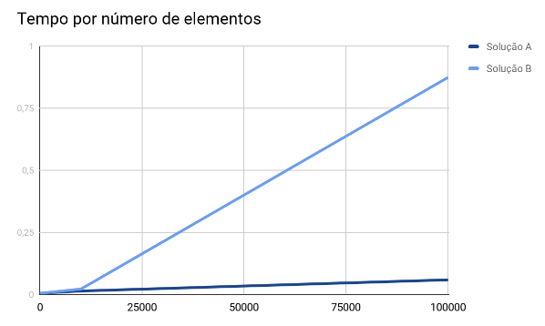

###### Universidade de Brasília - Faculdade Gama

###### Disciplina: Estrutura de Dados e Algoritmos 2

###### Professor: Maurício Serrano

###### Alunos:
  - Victor Matias Navarro - 14/0032932
  - Vítor Barbosa de Araujo - 14/0033149

###### Assunto: Lista de exercícios 2

#### 4. Imagine um vetor onde o menor elemento está na última posição. Explique (use um diagrama de um vetor com 11 posições) como o Shellsort garante que esse elemento conseguirá chegar à sua posição final através de trocas sucessivas baseadas no gap.


Imaginando um vetor de 11 elementos, o *gap* inicial será de 5 (divisão inteira de 11 / 2). Utilizando o vetor da imagem acima, têm-se os seguintes subgrupos (de acordo com o gap):

* 4, 2 e 1
* 7 e 8
* 11 e 3
* 8 e 9
* 10 e 5

Na primeira iteração do algoritmo, cada valor é arranjado em sua posição correta dentro do gap, isto é, cada gap estará ordenado:

* 1, 2 e 4
* 7 e 8
* 3 e 11
* 8 e 9
* 5 e 10

Ao fim da primeira iteração, o vetor se encontra desta maneira:


Como é possível perceber, ao fim da primeira iteração o menor elemento já se encontra em sua devida posição final, fazendo com que o Shell Sort seja mais rápido do que outros algoritmos que executam em tempo quadrático.

Ao fim da segunda iteração (onde o gap é 5 / 2 = 2) o vetor se encontra desta maneira:


Ao fim da terceira iteração (onde o gap é 2 / 2 = 1) o vetor se encontra desta maneira:


Na quarta iteração, o gap é 0 (divisão inteira de 1 / 2). Com isso o algoritmo termina e o vetor estará ordenado.


#### 5. Implemente o algoritmo Quicksort escolhendo a mediana como pivô. Utilize o algoritmo QuickSelect + Mediano of Medians visto em sala.

``` c++
#include <bits/stdc++.h>

using namespace std;

int get_median_out_of_5(vector<int> v){
    // use insertion sort in array of 5 elements
    for(int i=1;i < (int)v.size();i++){
        int j = i;

        while(j && (v[j] < v[j-1])){
            swap(v[j], v[j-1]);
            j--;
        }
    }

    // return median of this array
    return v[(v.size() - 1)/2];
}

// get median of medians
int get_mom(vector<int> v){
    vector<int> medians;

    for(int i=0;i<(int)v.size();i+=5){
        // divide into sets of 5
        vector<int> group;
        for(int j=i;j < i+5 && j < (int)v.size();j++){
            group.push_back(v[j]);
        }

        medians.push_back(get_median_out_of_5(group));
    }

    if(medians.size() > 5){
        return get_mom(medians);
    }

    return get_median_out_of_5(medians);
}

// mom = median of medians
int k_smallest(vector<int> v, int k){
    int mom = get_mom(v);

    if(v.size() <= 1) return mom;

    vector<int> left_values, right_values;

    for(auto c : v){
        if(c < mom) left_values.push_back(c);
        else if(c > mom) right_values.push_back(c);
    }

    int count_left = left_values.size();

    if(count_left > k - 1)
        return k_smallest(left_values, k);
    else if(count_left < k - 1)
        return k_smallest(right_values, k - count_left - 1);

    return mom;
}

int k_smallest(vector<int> v, int k, int low, int high){
    vector<int> temp;

    for(int i=low;i<=high;i++){
      temp.push_back(v[i]);
    }

    return k_smallest(temp, k);
}

// escolha do pivô como meio do vetor
// int get_pivot(vector<int> v, int low, int high){
//     return v[(low + high) / 2];
// }

void quick_sort(vector<int>& v, int low, int high){
    if(low <= high){
        int i = low;
        int j = high;

        // escolha do pivô como meio do vetor
        // int pivot = get_pivot(v, low, high);

        // escolha do vetor utilizando quick_select e mediana das medianas
        int pivot = k_smallest(v, (v.size() + 1) / 2, low, high);

        while(i <= j){
            while(v[i] < pivot) i++;
            while(pivot < v[j]) j--;

            if(i <= j){
                swap(v[i], v[j]);
                i++;
                j--;
            }
        }

        quick_sort(v, low, j);
        quick_sort(v, i, high);
    }
}

int main(){
    vector<int> v { 1, 5, 2, 8, 3, 7, 4, 6 };

    cout << "Vetor inicial: ";
    for(auto c : v) cout << c << " "; cout << endl;

    quick_sort(v, 0, v.size()-1);

    cout << "Vetor ordenado: ";
    for(auto c : v) cout << c << " "; cout << endl;

    return 0;
}
```

#### 6. Implemente o Heapsort das duas formas: o modo normal, que utiliza um único vetor, e a segunda forma, como uma estrutura separada onde a ordenação é feita inserindo todos os dados e depois removendo todos. Cronometre a execução e trace um gráfico. Qual a mais rápida? A taxa de crescimento é a mesma?

A solução mais rápida é a que utiliza apenas um vetor, que chamaremos de solução A. A solução B, que utiliza o vetor auxiliar, é significativamente mais lenta e pejorativa em questão de espaço de armazenamento. Isso porque, para vetores muito grandes, o dobro da memória utilizada não é algo aceitável.



No gráfico acima, percebe-se que: apesar de os dois comportarem-se de forma linear, a taxa de crescimento da solução B é muito maior do que a taxa de crescimento da solução A, sendo pouco recomendado o seu uso.

#### 7. Implemente um algoritmo que misture o Counting sort e o Radix sort para ordenar um vetor de nomes. Utilize qualquer lista pública de nomes. Cronometre a execução e trace um gráfico. A taxa de crescimento é mesmo linear?
