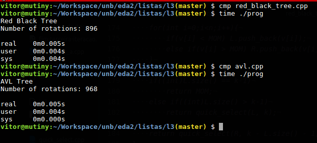

###### Universidade de Brasília - Faculdade Gama

###### Disciplina: Estrutura de Dados e Algoritmos 2

###### Professor: Maurício Serrano

###### Alunos:
  - Victor Matias Navarro - 14/0032932
  - Vítor Barbosa de Araujo - 14/0033149

###### Assunto: Lista de exercícios 3

#### 3. Implemente o Merge Sort de forma iterativa. Apresente de forma gráfica as trocas enquanto elas ocorrem.

```c++
#include <bits/stdc++.h>

using namespace std;

void print(vector<int> v, int from, int to, bool newline = true){
    cout << "[";
    for(int i=from;i<to;i++){
        if(i != from) printf(" ");
        cout << v[i];
    }
    cout << "]";
    if(newline) cout << endl;
}

// interactive merge sort
void interactive_merge_sort(vector<int>& v){
    int h = 1, size = 2;
    int n = v.size();

    cout << "INITIAL V: ";
    print(v, 0, v.size());

    while(h < n){
        printf("\n-----------------------\n");
        printf("SETS WITH [%d] ELEMENTS\n", size);
        vector<int> temp;

        for(int i=0;i<n;i+=size){
            int p1 = i;
            int p2 = i + h;

            printf("\nORDERING THIS SET: ");
            print(v, i, i + size);
            printf("DIVIDING SET INTO TWO PARTS: ");
            print(v, i, i+h, false);
            print(v, i+h, i+size);

            while(p1 < i + h && p2 < i + size){
                if(v[p1] < v[p2]){
                    printf("Insert %d from first part\n", v[p1]);
                    temp.push_back(v[p1++]);
                }
                else{
                    printf("Insert %d from second part\n", v[p2]);
                    temp.push_back(v[p2++]);
                }
                print(temp, i, temp.size());
            }

            while(p1 < i + h){
                printf("Insert %d from first part\n", v[p1]);
                temp.push_back(v[p1++]);
                print(temp, i, temp.size());
            }
            while(p2 < i + size){
                printf("Insert %d from second part\n", v[p2]);
                temp.push_back(v[p2++]);
                print(temp, i, temp.size());
            }

            printf("DONE! ORDERED SET: ");
            print(temp, i, i + size);
            printf("...\n");
        }

        for(int i=0;i<n;i++){
            v[i] = temp[i];
        }
        temp.clear();

        printf("V: ");
        print(v, 0, v.size());

        printf("-----------------------\n");

        h = size;
        size *= 2;
    }

    printf("SORTED V: ");
    print(v, 0, v.size());
}

int main(){
    vector<int> v { 4,7,1,234,234,234,2,35,662,7,24,
                    473,23,51,72,52,436,26,3,38,586956,
                    8,54,998,47,9,68,675,643,53,424,5,
                    635,24,352,2424,22,3,5,9,6
                  };
    vector<int> v2 { 3,5,1,2,4,9,8,7 };

    interactive_merge_sort(v2);

    return 0;
}

```

#### 4. Ordene uma lista de nomes usando o Radix Sort com Counting Sort. Use qualquer lista pública de nomes. Lembre-se de preencher os espaços vazios com caracteres para que os nomes tenham o mesmo tamanho.

```c++
#include <bits/stdc++.h>

using namespace std;


vector<string> names = {"Enzo", "Lis", "Miguel", "Pietro", "Bryan",
                        "Valentina", "Isabella", "Beatriz", "Maria Eduarda",
                        "Maria Clara", "Arthur", "Alice", "Sophia", "Enzo Gabriel",
                        "Gael", "Ana Clara", "Henri", "Wallace", "Filipe", "Mel", "Laura", "Nícolas"};

void fill_vector(vector<string>&v){
  v = names;
  printf("Size: %d\n", (int)v.size());
}

int find_maximum(vector<string> x){
  int max = 0;
  for(int i=0; i< (int)x.size(); ++i){
    if(max < (int) x[i].size()){
      max = x[i].size();
    }
  }
  return max;
}

void print_vector(vector<string> v){
  for(int i=0; i< (int)v.size(); ++i){
    printf("%s\n", v[i].c_str());
  }
}

void partial_sum(vector<int>& v){
  for(int i=1; i< (int) v.size(); ++i){
    v[i] += v[i-1];
  }
}

void counting_sort(vector<string>& v, int index){
  vector<string> aux(v.size());
  vector<int> count(257, 0);

  for(int i=0; i< (int)v.size(); ++i){
    count[index < (int) v[i].size() ? (int)(unsigned char) v[i][index]+1 : 0]++;
  }

  partial_sum(count);

  for(int i = (int) v.size() - 1; i >= 0; --i){
    aux[count[index < (int) v[i].size()? (int)(unsigned char) v[i][index]+1 : 0] - 1] = v[i];
    count[index < (int) v[i].size()? (int)(unsigned char)v[i][index] +1 : 0]--;
  }

  for(int i = 0; i < (int)v.size(); ++i){
    v[i] = aux[i];
  }

  count.clear();
  aux.clear();
}

void radix_sort(vector<string>& v){
  int max = find_maximum(v);
  for(int i = max; i > 0; --i){
    counting_sort(v, i-1);
  }
}

int main(){
    vector<string> v;
    fill_vector(v);
    printf("Desordenado:\n");
    print_vector(v);
    radix_sort(v);
    printf("\nOrdenado:\n");
    print_vector(v);
    return 0;
}
```

Esse código não altera as _strings_ originais de forma a adicionar espaços para equivaler o tamanho das _strings_, porém na hora de comparar, o algoritmo analisa se o espaço que ele está comparando neste momento existe em ambas as _strings_. Caso não exista em alguma, ele substitui o caractere a ser comparado, dando o mesmo resultado que encher de espaços vazios.

#### 5. Altere o código da mediana em tempo linear para utilizar grupos de sete elementos ao invés de cinco.

```c++
#include <bits/stdc++.h>

#define N_GROUPS 7

using namespace std;

void print(vector<int> v, int from, int to, bool newline = true){
    cout << "[";
    for(int i=from;i<to;i++){
        if(i != from) printf(" ");
        cout << v[i];
    }
    cout << "]";
    if(newline) cout << endl;
}

int get_median(vector<int> v, int from, int to){
    vector<int> temp;
    for(int i=from;i<to;i++){
        temp.push_back(v[i]);
    }

    sort(temp.begin(), temp.end());

    int median = temp[(temp.size()-1) / 2];

    return median;
}

vector<int> get_mom(vector<int> v){
    vector<int> medians;
    int n = v.size();

    for(int i=0; i<n; i += N_GROUPS){
        int m = get_median(v, i, min(i + N_GROUPS, n));
        medians.push_back(m);
    }

    return medians;
}

int quick_select(vector<int> v, int k){
    int n = v.size();


    vector<int> medians = v;

    do{
        medians = get_mom(medians);
    }while(medians.size() > 1);

    int MOM = medians[0];

    vector<int> L, R;

    for(int i=0;i<n;i++){
        if(v[i] < MOM) L.push_back(v[i]);
        else if(v[i] > MOM) R.push_back(v[i]);
    }

    if((int)L.size() == k-1)
        return MOM;
    else if((int)L.size() > k-1)
        return quick_select(L, k);

    return quick_select(R, k - L.size() - 1);
}

int main(){
    vector<int> v { 9,4,8,3,7,1,2,6,5 };

    print(v, 0, v.size());

    cout << "Median: " << quick_select(v, (v.size() + 1)/2) << endl;

    return 0;
}
```

#### 6. Gere 1000 números randômicos de 0 a 10000. Conte as rotações e cronometre a inserção de todos os números em uma Árvore AVL e em uma Árvore V&P. Qual fez mais rotações? Qual foi mais rápida?

Segundo a imagem abaixo, é possível perceber que a árvore Vermelha e Preta faz menos rotações que a árvore AVL. Entretanto, o tempo de execução dos algoritmos das duas árvores é bastante similar para os 1000 números randômicos gerados.



*Obs.:* Os códigos referentes à implementação das árvores AVL e Vermelha e Preta se encontram no arquivo __.zip__ enviado.
